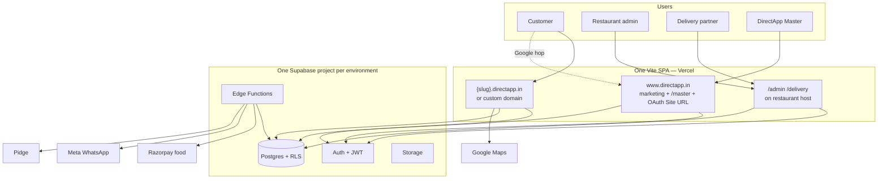
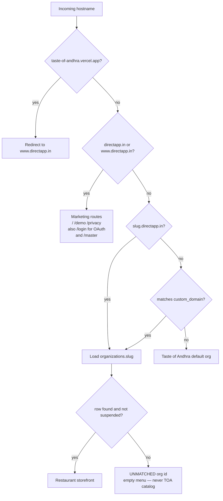
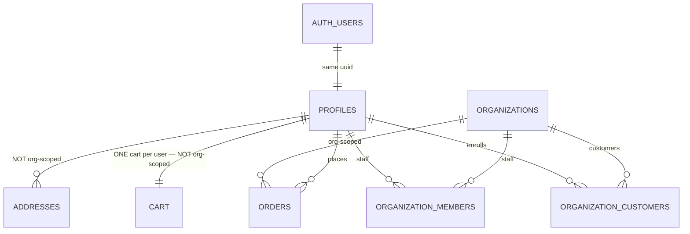
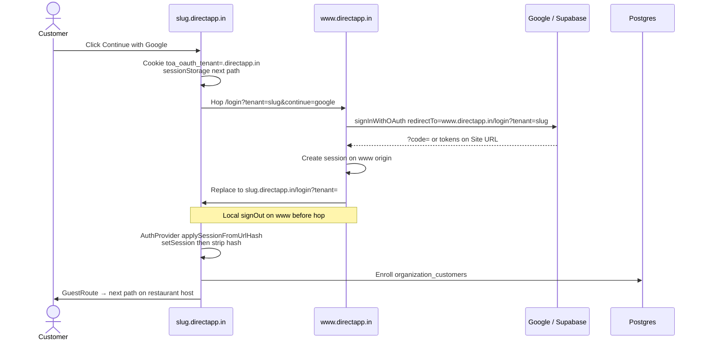
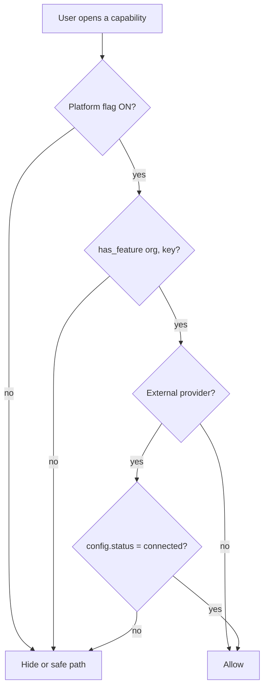

# DirectApp — Architecture and SaaS model (as-built)

**Audience:** Architect validation  
**Product:** DirectApp (`directapp.in`)  
**Codebase:** `taste-of-andhra` (one Vite SPA)  
**As of:** 2026-08-18 (includes same-day OAuth, WhatsApp, and host-routing changes)  
**Status:** Two live restaurants. SaaS billing is Master-assigned (not auto-charged).

Use **this document** as the as-built contract.  
`SAAS_MULTI_TENANT_ARCHITECTURE.md` is the original **plan** (July 2026) and is stale on Master UI, host tenancy, and OAuth.

---

## How to use this for validation

1. Confirm the **decisions** in §1–§3 (tenancy style, hosts, identity).  
2. Walk the **flows** in §4–§6 with the diagrams (host → org, Google login, entitlements).  
3. Check the **isolation matrix** in §7 against a failing feature. Most storefront bugs are “wrong org”, “wrong host after Google”, or “shared customer row used as if it were tenant-local”.  
4. Use the **checklist** in §15. Do not sign off a tenant until those items pass on **that tenant’s host**.

---

## 1. Product snapshot

DirectApp is a **single codebase, single Vercel deployment, shared-database multi-tenant SaaS** for restaurants.

| Concept | As built |
|---------|----------|
| Platform brand | **DirectApp** — `https://www.directapp.in` (marketing + Master + Google OAuth Site URL) |
| Tenant #1 | Taste of Andhra — `thetasteofandhra.directapp.in` and `www.thetasteofandhra.com` |
| Tenant #2 | Chopstick Spice Malabar — `chopsticksspicemalabar.directapp.in` |
| Retired host | `spice-malabar.directapp.in` must not be used or aliased |
| Tenancy | Shared Postgres + `organization_id` + RLS (not DB-per-tenant) |
| Go-to-market | Sales-led Master onboarding. Marketing `/demo` is a lead form, not self-serve signup |
| SaaS money | Manual `subscriptions` row. Food payments (UPI / Razorpay / COD) are a **separate** product |

Taste of Andhra is **tenant #1**, not the platform. A second restaurant must not inherit Taste of Andhra URLs, copy, UPI IDs, login helpers, or WhatsApp defaults.

---

## 2. What changed recently (same-day architecture)

These landed on `main` on 2026-08-18 and **must** be part of architect review. Several production bugs were in this area (Google landing on the wrong restaurant, session missing after hop, WhatsApp showing on a tenant that did not enable it).

| Change | Why it exists | Architect implication |
|--------|----------------|------------------------|
| Google OAuth Site URL is **www.directapp.in**, not a restaurant | Tenant subdomains are often missing from Supabase redirect allowlist; Site URL used to be Taste of Andhra | Login is a **cross-origin hop**: restaurant → platform → Google → platform → restaurant, with tokens in the URL hash for one hop |
| `toa_oauth_tenant` cookie on `.directapp.in` | sessionStorage is origin-scoped and is lost on the hop | Cookie + `?tenant=` + hash tokens are the session bridge. If any hop fails, the customer is logged in on the **wrong host** or not at all |
| Master login on **www.directapp.in/master/login** | Master is the platform, not Taste of Andhra | Do not test Master on a restaurant host as the canonical path |
| Per-org `storefront_whatsapp_enabled` | Click-to-WhatsApp leaked Taste of Andhra behaviour onto new tenants | Off by default for new restaurants; Taste of Andhra stays on until turned off |
| Per-org `whatsapp_otp_login_enabled` | Same leak on `/login` | Independent of click-to-WhatsApp and of Meta order notifications |
| WhatsApp order opt-in default **only** for Taste of Andhra org id | Other tenants were opted in automatically | Trigger `orders_force_whatsapp_opt_in` is hardcoded to tenant #1 UUID |
| Spice Malabar slug = `chopsticksspicemalabar` | Old `spice-malabar` host retired | DNS/bookmarks to the old host are a live incident class |
| Tenant display name from `organizations.name` | Admin login showed the wrong restaurant | Branding must come from org row, never `APP_NAME` fallback for another slug |
| `organization_customers` enrollment | Shared Google identity, per-restaurant membership | Orders are org-scoped; **cart and addresses are still user-scoped only** |
| GST is opt-in per restaurant | Not every tenant invoices GST | Invoice creation must no-op when GST is off |
| Phone/counter orders + `/pay/:token` | Staff-placed orders need a shareable UPI/Razorpay page | Payment links must stay on `window.location.origin` of the **current** host |
| Onam Sadhya overlay | Spice Malabar seasonal SKU, not a platform module | Hardcoded tenant check (`isSpiceMalabarStorefront`), not an entitlement key |

---

## 3. System context



| Layer | Choice |
|-------|--------|
| Frontend | React 19, TypeScript, Vite 8, Tailwind 4, React Router 7 |
| Backend | Supabase Postgres, Auth, Storage, RLS. **No** Nest/Next API server |
| Privileged I/O | Edge Functions + service role (webhooks, owner invite, WhatsApp send) |
| Client data | `@supabase/supabase-js` + anon key + user JWT |
| Deploy | One Vercel project; SPA rewrite `/(.*) → /index.html` |
| Env bake | `VITE_*` is compile-time. Host resolution / OAuth origin / Supabase URL require a **new Production deploy** |

---

## 4. Environments

Pushing frontend code **does not** copy tenant rows.

| Role | Supabase | Typical access |
|------|----------|----------------|
| Local / staging | `zsfjpapatepmnbtxvvaw` (`taste-of-andhra-staging`) | `.env.local` |
| Production | `qixpsqlifwsztncjevgl` (`taste-of-andhra`) | Vercel `VITE_SUPABASE_*` |

Required Production env:

```text
VITE_ENABLE_HOST_TENANT_RESOLUTION=true
VITE_PLATFORM_ROOT_DOMAIN=directapp.in
VITE_AUTH_OAUTH_CALLBACK_ORIGIN=https://www.directapp.in
VITE_SUPABASE_URL=https://qixpsqlifwsztncjevgl.supabase.co
VITE_SUPABASE_ANON_KEY=…
```

Symptom of missing host flag: every hostname shows Taste of Andhra menu.  
Symptom of org/catalog missing in **prod** DB: correct branding, empty menu.

A **draft** (not agreed) for Testing/Sandbox clones is `docs/DRAFT_ENV_AND_CODE_ACCESS_ARCHITECTURE.md`.

---

## 5. Host and routing

### 5.1 Host matrix



| Host | What the SPA serves |
|------|---------------------|
| `www.directapp.in` / `directapp.in` | DirectApp marketing. Master console. Google OAuth return. **Not** a restaurant menu |
| `thetasteofandhra.directapp.in` | Taste of Andhra storefront |
| `www.thetasteofandhra.com` | Same org (custom domain) |
| `chopsticksspicemalabar.directapp.in` | Spice Malabar storefront |
| `www.{slug}.directapp.in` | **Unsupported** (wildcard DNS does not cover it) |
| `spice-malabar.directapp.in` | **Retired** — do not serve |
| `{slug}.localhost` / `?tenant=` | Local resolution |

Checkout, cart, payment links, invoices, and OAuth **redirectTo** must use `window.location.origin` of the host the customer is on after handoff (the restaurant), not Taste of Andhra and not `APP_NAME`.

### 5.2 Two route trees in one SPA

`createAppRouter()` picks **once** from hostname:

| Tree | Hosts | Notable routes |
|------|-------|----------------|
| Marketing | Apex DirectApp | `/`, `/demo`, `/privacy`, `/login` (OAuth only), `/master/*`, `/admin/login` |
| Restaurant | Tenant subdomain or custom domain | Full storefront + `/admin` + `/delivery` + `/master` still mounted on `sharedStaffRoutes` |

If Google returns to www.directapp.in, the customer is on the **marketing tree** until `OAuthTenantHandoff` sends them to `{slug}.directapp.in/login#tokens`.

### 5.3 Tenant resolution code path

1. `src/utils/tenantHost.ts` — slug from host / `?tenant=` / sessionStorage  
2. `src/contexts/OrganizationContext.tsx` — fetch `organizations` by slug or `custom_domain`  
3. `src/services/currentOrganization.ts` — module-level id used by services  
4. Queries filter `organization_id`; RLS should enforce the same

Unmatched slug → `00000000-0000-0000-0000-000000000000` so the UI does **not** fall back to Taste of Andhra dishes.

---

## 6. Identity and Google OAuth (highest bug density)

### 6.1 Identity model



| Store | Scope | Consequence |
|-------|--------|-------------|
| `auth.users` / `profiles` | Global | One Google/email/phone identity across restaurants |
| `organization_customers` | Per org | Enroll on login to that host (`CustomerEnrollmentSync`) |
| `organization_members` | Per org | Staff |
| `orders`, menu, settings | Per org | Correct isolation if RLS + query filter both apply |
| `cart`, `addresses`, `favorites`, `reviews` | **User only** | A customer who used Taste of Andhra then Spice Malabar can keep a **shared cart/addresses**. This is a known functional gap |

`profiles.role` is still `customer | admin | delivery | platform_master`.  
Admin **routes** still require `profiles.role === 'admin'`. Membership-scoped auth (`VITE_ENABLE_SCOPED_ORG_ADMIN_AUTH`) is **defined and unused**.

### 6.2 Google login sequence (as implemented)

Constraint: Supabase **Site URL** is `https://www.directapp.in`. Tenant hosts are not a reliable OAuth return origin.



Supporting pieces:

| Piece | Role |
|-------|------|
| `googleOAuthPreflightUrl` | Bounce tenant host → www (or `{slug}.localhost` → `localhost`) so PKCE stays on one origin |
| `persistOAuthTenantCookie` | 10-minute `SameSite=Lax Secure` cookie on `.directapp.in` |
| `OAuthTenantHandoff` | After session on www, copy tokens to restaurant origin |
| `applySessionFromUrlHash` | PKCE ignores `#access_token`; must `setSession` on the tenant |
| `recoverOAuthTenantHostIfNeeded` | Early bounce if the wrong `{slug}.directapp.in` loaded (does **not** bounce www or Taste of Andhra custom domain — those finish OAuth first) |
| `prompt: select_account` | Avoid silently reusing the previous Google account after logout |

**Validation failures this flow is known to produce**

1. Customer stays on www.directapp.in after Google (handoff did not run).  
2. Lands on Spice Malabar **without** a session (hash not applied, or hop before session existed).  
3. Lands on Taste of Andhra after starting on Spice Malabar (cookie/`?tenant=` lost; Site URL historically was TOA).  
4. Login works once, fails after logout (cached session / missing `select_account`).  
5. Tokens visible in the address bar for one navigation (hash). Treat as a security review item.

Email/password and WhatsApp OTP stay **on the restaurant origin** and do not use this hop.

### 6.3 Other auth

| Method | Who | Tenant-aware? |
|--------|-----|----------------|
| Email + password | All personas | Yes — used on current host; profile is still global |
| WhatsApp OTP | Customers | Only if `organizations.settings.whatsapp_otp_login_enabled` (Taste of Andhra defaults on) |
| Google | Customers | Cross-origin hop above |
| Master | `platform_master` (or seeded master email while enum lag) | Canonical: `https://www.directapp.in/master/login` |

---

## 7. Data isolation matrix (validate features here)

| Data | Isolated by `organization_id`? | Notes for bugs |
|------|--------------------------------|----------------|
| Categories, dishes, modifiers | Yes | Empty menu on a correct host = **prod not seeded**, not a frontend bug |
| Orders, order_items, payments | Yes | History is per restaurant |
| Offers, branches, QR, GST invoices | Yes | Composite unique keys include org |
| Delivery partners / settings / quotes | Yes | Pidge credentials still **platform env** unless a future flag |
| App / org settings, UPI, GST toggle | Yes | UPI on checkout must be **this** org’s VPA |
| WhatsApp config + outbox | Yes | Webhook maps `phone_number_id` → org |
| Customer enrollment | Yes (`organization_customers`) | |
| Staff membership | Yes (`organization_members`) | Route guard still uses global `profiles.role` |
| **Cart** | **No** | One `cart` row per `user_id` |
| **Addresses** | **No** | Shared across restaurants |
| **Favorites / reviews / loyalty / notifications** | **No / partial** | Dish already has org; UX may still mix |
| Profiles | Global | Same Google user at many restaurants |

**Rule for incident triage:** if the **branding** is correct but **data** is Taste of Andhra (or empty), check host flag, prod seed, then this matrix. If branding **and** data are the wrong restaurant, check OAuth handoff / default org fallback.

---

## 8. Control plane vs tenant plane

| Plane | Routes | Actor |
|-------|--------|--------|
| Marketing | `/`, `/demo` on www | Anonymous leads → `platform_demo_requests` |
| Storefront | `/`, `/menu`, `/cart`, `/checkout`, `/qr/:code`, `/b/:slug`, `/pay/:token`, `/onam` | Customer |
| Restaurant ops | `/admin/*` | Owner / admin |
| Delivery | `/delivery/*` | Partner |
| Control plane | `/master/*` | DirectApp Master |

Master can: list/create tenants, set homepage/custom domain, import setup+menu CSV, toggle entitlements (restaurant admins cannot), set plan/status/period/suspend.

Master cannot yet: charge SaaS via Razorpay/Stripe, self-serve signup, audited “act as tenant”.

---

## 9. SaaS commercial model

### 9.1 Three gates



`has_feature()`: subscription `trialing` or `active` and `current_period_end > now()`, then entitlement row, else `default_enabled` / plan features.

### 9.2 Plans (database)

| Plan | Code | List price | Includes |
|------|------|------------|----------|
| Starter | `starter` | ₹0 / month | Core ops + Direct UPI + COD |
| Growth | `growth` | ₹999 / mo · ₹9,990 / yr | + WhatsApp notifications + SMS |
| Pro | `pro` | ₹2,499 / mo · ₹24,990 / yr | + Razorpay, WhatsApp ordering, loyalty, branches |

Marketing site still shows “Talk to us / Custom”. Access is **not** collected by a billing provider (`provider` on subscriptions is typically `manual`). Onboarding: 30-day trial or paid monthly/yearly; Master picks add-ons.

**Do not mix** restaurant food settlement with DirectApp subscription charges.

### 9.3 Feature catalog

| Kind | Keys |
|------|------|
| Core (cannot disable) | `menu`, `orders`, `customers`, `settings` |
| Base | `offers`, `reports`, `delivery_own`, `payments_direct_upi` |
| Add-ons | `branches`, `qr_tables`, `party_inquiries`, `delivery_pidge`, `loyalty`, `payments_razorpay`, `whatsapp_notifications`, `whatsapp_ordering`, `sms_notifications` |

Dependencies: e.g. `whatsapp_ordering` requires notifications + orders + menu.

---

## 10. Four WhatsApp surfaces (do not collapse these)

Bugs happen when testers treat “WhatsApp” as one switch.

| Surface | Control | Default for new restaurant | What it does |
|---------|---------|----------------------------|--------------|
| A. Storefront click-to-chat | `organizations.settings.storefront_whatsapp_enabled` | **Off** (Taste of Andhra on until disabled) | `wa.me` links on nav/FAB/menu/cart — **not** Cloud API |
| B. WhatsApp OTP login | `organizations.settings.whatsapp_otp_login_enabled` | **Off** (Taste of Andhra on until disabled) | `/login` OTP; needs Meta `login_otp` template + connected config |
| C. Order status notifications | entitlement `whatsapp_notifications` + `organization_whatsapp_configs` + order `whatsapp_updates_opt_in` | Opt-in default **true only for Taste of Andhra UUID** | Cloud API / mock outbox |
| D. In-chat browse / order | entitlement `whatsapp_ordering` + webhook conversation | Browse implemented; **checkout in chat not shipped** | Dual channel with web; totals must stay server-side |

Restaurant admin Settings owns A and B. Master entitlements own C and D. Meta connection is per org (`connected` vs `disconnected`).

---

## 11. Food payments (not SaaS billing)

| Path | Who | Paid truth |
|------|-----|------------|
| COD | All plans | Ops |
| Direct UPI | Starter default; org UPI ID in settings | Admin **Mark collected**. Customer “I’ve paid” is a claim only. **No bank webhook** |
| Razorpay | Add-on `payments_razorpay` | Edge `razorpay-confirm` + idempotent `razorpay-webhook` |
| Razorpay Route | Held | `VITE_ENABLE_RAZORPAY_ROUTE` false |
| Share page `/pay/:token` | Phone/counter and UPI QR | Must be current storefront origin |

`organization_payment_configs` exists (DIRECT / ROUTE). Route must not appear in restaurant UI.

---

## 12. Other product seams

| Seam | Live | Held / tenant-specific |
|------|------|-------------------------|
| Delivery | Own fleet; Pidge via **platform** secrets | Per-tenant Pidge config flag off |
| Maps | Optional Google Maps pin / geocode | Checkout pin required for customer delivery |
| GST | Opt-in org setting + GSTIN | Invoice skipped when off |
| Phone/counter order | Admin single-screen + share pay link | |
| Onam Sadhya | Spice Malabar only (`isSpiceMalabarStorefront`) | Not a feature_key; admin `/admin/onam-orders` |
| Printer | Optional local print agent | |
| AI | — | `VITE_ENABLE_AI` off |
| Customer order status | View-only after place (cannot self-advance) | |

---

## 13. Runtime composition

```
AuthProvider
  OrganizationProvider     host → organization_id
    BranchProvider
      CartProvider         user cart (not org)
        FavoritesProvider
          CustomerEnrollmentSync
          OAuthTenantHandoff
          Router
```

Boot (`main.tsx`): canonical Vercel alias redirect, then OAuth wrong-host recovery, then React.

Edge Functions: `razorpay-webhook`, `razorpay-confirm`, `whatsapp-*`, `pidge-*`, `delivery-quote`, `communication-dispatch`, `master-onboard-owner`.

---

## 14. Held flags (defaults off unless noted)

| Flag | Production intent |
|------|-------------------|
| `VITE_ENABLE_HOST_TENANT_RESOLUTION` | **Must be true** in Production |
| `VITE_ENABLE_SCOPED_ORG_ADMIN_AUTH` | Off; **not wired** into `AdminRoute` |
| `VITE_ENABLE_RAZORPAY_ROUTE` | Off |
| `VITE_ENABLE_META_EMBEDDED_SIGNUP` | Off |
| `VITE_ENABLE_AI` | Off |
| SaaS auto-billing / WhatsApp usage billing / per-tenant Pidge | Documented hold |

---

## 15. Architect validation checklist

Run on **each** live host (`thetasteofandhra…`, `www.thetasteofandhra.com`, `chopsticksspicemalabar…`), not only localhost.

### Host and catalog

- [ ] `VITE_ENABLE_HOST_TENANT_RESOLUTION=true` on the Production **build** that is live  
- [ ] Org row + categories/dishes exist in **production** Supabase for that slug  
- [ ] Unknown slug → empty menu, **not** Taste of Andhra dishes  
- [ ] `spice-malabar.directapp.in` is not treated as the live Spice Malabar storefront  
- [ ] Navbar/title/UPI/phone are this org, never `APP_NAME` / `tasteofandhra@okaxis` on another tenant  

### Auth

- [ ] Email login on tenant host stays on that host  
- [ ] Google from Spice Malabar returns **to Spice Malabar logged in** (not www, not TOA, not logged-out storefront)  
- [ ] Google after logout prompts account chooser and still returns to the starting restaurant  
- [ ] WhatsApp OTP button hidden unless that org enabled it  
- [ ] Same Google user can enroll at two restaurants; **orders** lists are per host  
- [ ] Cart/address sharing across restaurants is either accepted as current design or listed as a defect  

### Payments and ops

- [ ] Starter checkout shows Direct UPI / COD, not Razorpay, unless entitled  
- [ ] UPI QR uses **this** restaurant VPA  
- [ ] “I’ve paid” does not mark collected; admin mark-paid does  
- [ ] `/pay/:token` stays on the current origin  
- [ ] GST invoice only when GST enabled  

### WhatsApp

- [ ] Click-to-chat FAB absent when storefront WhatsApp is off  
- [ ] Order notification opt-in default is off except Taste of Andhra  
- [ ] Meta messages do not send when config ≠ `connected`  

### Control plane

- [ ] Master at `https://www.directapp.in/master/login`  
- [ ] Restaurant admin cannot toggle Master feature catalog  
- [ ] New onboard seeds `storefront_whatsapp_enabled: false` unless requested  

### Security / tenancy (sign-off)

- [ ] Org A admin cannot read Org B menu/orders via API (RLS). **No automated two-org isolation test in CI today**  
- [ ] OAuth hash handoff reviewed (tokens in URL for one hop)  
- [ ] Admin membership vs global `profiles.role` accepted or scheduled for cutover  

---

## 16. Questions for the architect

1. Shared DB + RLS for the next 20–50 restaurants, or split earlier?  
2. Move admin authorization fully to `organization_members` before tenant #3?  
3. Keep sales-led SaaS billing, or provider subscriptions (Razorpay vs Stripe)?  
4. Approve Direct UPI as Starter default with no bank webhook?  
5. **Must-fix:** org-scope `cart` and `addresses`, or document cross-tenant cart as accepted?  
6. Replace hash token handoff with a same-site auth cookie / dedicated callback host?  
7. Stay on two Supabase projects, or add Testing + Sandbox as in the draft env doc?  
8. WhatsApp in-chat checkout this year, or web + click-to-chat only?  

---

*Code anchors:* `src/utils/tenantHost.ts`, `src/utils/oauthRedirect.ts`, `src/utils/oauthHandoff.ts`, `src/utils/authTenantCookie.ts`, `src/contexts/OrganizationContext.tsx`, `src/constants/ARCHITECTURE_GATES.ts`, `src/utils/tenantFeatures.ts`  
*Related:* `docs/ARCHITECTURE_GATES.md` · `docs/PRODUCTION_TENANT_SETUP.md` · `docs/DOMAIN_SETUP.md` · `docs/STARTER_DIRECT_UPI.md` · `docs/WHATSAPP_COMMERCE_ARCHITECTURE.md`
