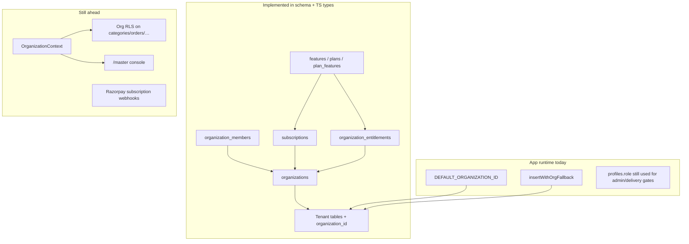
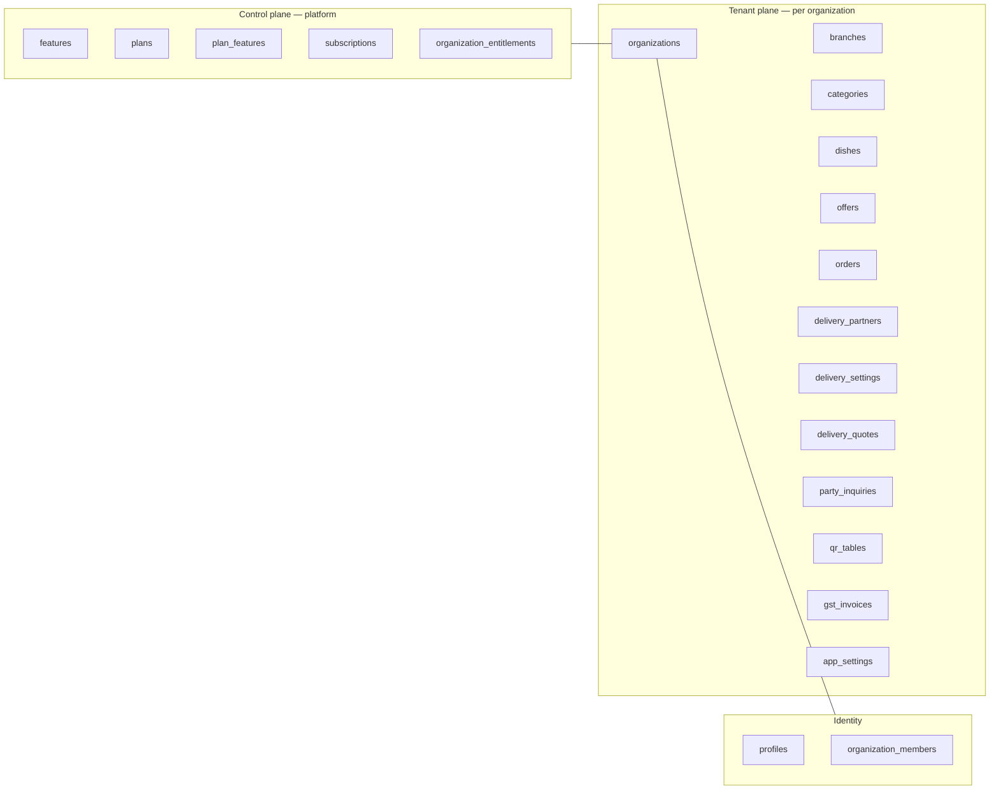
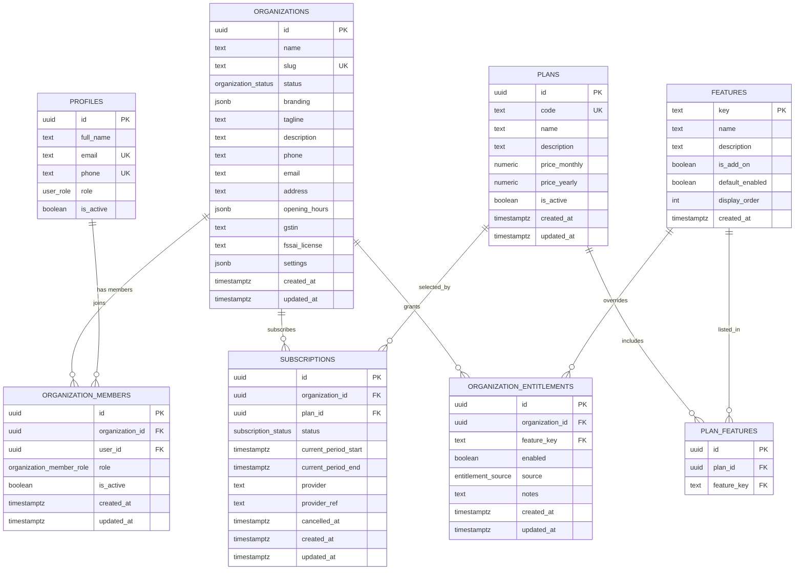
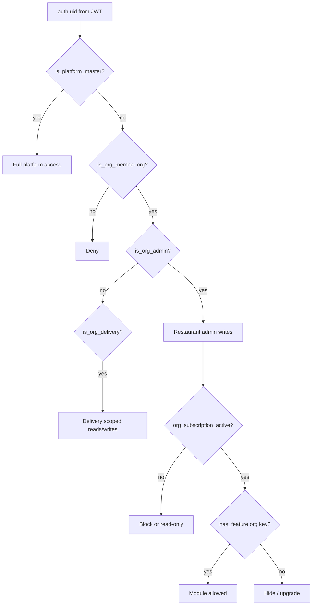
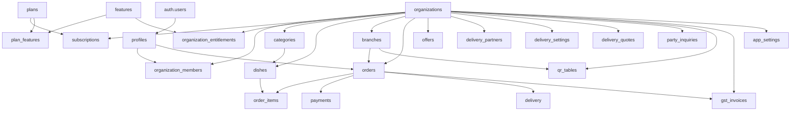

# SaaS Database Diagram (Post Phase-1 Model)

**Source of truth:** `supabase/migrations/20260727120000_saas_multi_tenant_model.sql`  
**Related:** [SAAS_MULTI_TENANT_ARCHITECTURE.md](./SAAS_MULTI_TENANT_ARCHITECTURE.md)  
**First tenant:** Taste of Andhra (`slug = taste-of-andhra`, fixed id `a0000000-0000-4000-8000-000000000001`)

---

## 1. Architecture after the change (what landed)

| Layer | Status | Notes |
|-------|--------|--------|
| Domain tables (orgs, members, plans, features, subscriptions, entitlements) | **Schema in repo** | Migration file; apply to Supabase before relying on NOT NULL `organization_id` |
| `organization_id` on tenant ops tables | **Schema in repo** | Backfill + composite unique indexes |
| Helpers (`is_org_admin`, `has_feature`, …) | **Schema in repo** | SECURITY DEFINER for RLS |
| RLS on new SaaS tables | **Schema in repo** | Org-scoped policies on control-plane tables |
| RLS rewrite on legacy tables | **Not done** | Still largely global `is_admin()` |
| App `OrganizationContext` / slug tenancy | **Not done** | App uses `DEFAULT_ORGANIZATION_ID` + insert fallbacks |
| Master UI `/master/*` | **Not done** | Phase 4 |
| SaaS billing webhooks | **Not done** | Phase 4 |



---

## 2. Logical domains



---

## 3. Control-plane ER (SaaS core)



### Enums (new)

| Enum | Values |
|------|--------|
| `organization_status` | `active`, `trialing`, `suspended`, `cancelled` |
| `organization_member_role` | `restaurant_owner`, `restaurant_admin`, `delivery` |
| `subscription_status` | `trialing`, `active`, `past_due`, `cancelled`, `suspended` |
| `entitlement_source` | `plan`, `addon`, `manual` |
| `user_role` (extended) | existing + `platform_master` |

---

## 4. Tenant operations ER (with `organization_id`)

Every box below is scoped by `organization_id → organizations.id` (ON DELETE CASCADE) unless noted.

```mermaid
erDiagram
  ORGANIZATIONS ||--o{ BRANCHES : owns
  ORGANIZATIONS ||--o{ CATEGORIES : owns
  ORGANIZATIONS ||--o{ DISHES : owns
  ORGANIZATIONS ||--o{ OFFERS : owns
  ORGANIZATIONS ||--o{ ORDERS : owns
  ORGANIZATIONS ||--o{ DELIVERY_PARTNERS : owns
  ORGANIZATIONS ||--o{ DELIVERY_SETTINGS : owns
  ORGANIZATIONS ||--o{ DELIVERY_QUOTES : owns
  ORGANIZATIONS ||--o{ PARTY_INQUIRIES : owns
  ORGANIZATIONS ||--o{ QR_TABLES : owns
  ORGANIZATIONS ||--o{ GST_INVOICES : owns
  ORGANIZATIONS ||--o{ APP_SETTINGS : owns

  CATEGORIES ||--o{ DISHES : contains
  BRANCHES ||--o{ ORDERS : fulfills
  BRANCHES ||--o{ QR_TABLES : has
  BRANCHES ||--o{ GST_INVOICES : issues
  BRANCHES ||--o{ DELIVERY_SETTINGS : configures
  PROFILES ||--o{ ORDERS : places
  ORDERS ||--|| PAYMENTS : paid_by
  ORDERS ||--o{ ORDER_ITEMS : lines
  ORDERS ||--o| DELIVERY : assigned
  DISHES ||--o{ ORDER_ITEMS : referenced
  ORDERS ||--o| GST_INVOICES : invoiced
  DELIVERY_QUOTES ||--o| ORDERS : consumed_by

  ORGANIZATIONS {
    uuid id PK
    text slug UK
  }

  BRANCHES {
    uuid id PK
    uuid organization_id FK
    text slug
    boolean is_default
  }

  CATEGORIES {
    uuid id PK
    uuid organization_id FK
    text slug
  }

  DISHES {
    uuid id PK
    uuid organization_id FK
    uuid category_id FK
    text slug
  }

  OFFERS {
    uuid id PK
    uuid organization_id FK
    text coupon_code
  }

  ORDERS {
    uuid id PK
    uuid organization_id FK
    text order_number
    uuid user_id FK
    uuid branch_id FK
  }

  ORDER_ITEMS {
    uuid id PK
    uuid order_id FK
    uuid dish_id FK
  }

  PAYMENTS {
    uuid id PK
    uuid order_id FK
  }

  DELIVERY {
    uuid id PK
    uuid order_id FK
  }

  DELIVERY_PARTNERS {
    uuid id PK
    uuid organization_id FK
    text phone
  }

  DELIVERY_SETTINGS {
    uuid id PK
    uuid organization_id FK
    uuid branch_id FK
  }

  DELIVERY_QUOTES {
    uuid id PK
    uuid organization_id FK
    uuid user_id FK
  }

  PARTY_INQUIRIES {
    uuid id PK
    uuid organization_id FK
  }

  QR_TABLES {
    uuid id PK
    uuid organization_id FK
    uuid branch_id FK
    text table_code
  }

  GST_INVOICES {
    uuid id PK
    uuid organization_id FK
    uuid order_id FK
    text invoice_number
  }

  APP_SETTINGS {
    uuid organization_id PK_FK
    text key PK
    text value
  }
```

### Tables that stay global (no `organization_id` yet)

| Table | Why |
|-------|-----|
| `profiles` | Shared auth identity; tenancy via `organization_members` |
| `addresses`, `cart`, `cart_items` | Customer-owned; multi-restaurant cart is Phase 2+ |
| `reviews`, `favorites` | Tied to dish/user; dish already carries org |
| `loyalty_*`, `notifications` | Not org-scoped in this migration |

---

## 5. Composite uniqueness (per tenant)

| Table | Unique key |
|-------|------------|
| `categories` | `(organization_id, slug)` |
| `dishes` | `(organization_id, slug)` |
| `orders` | `(organization_id, order_number)` |
| `offers` | `(organization_id, coupon_code)` where coupon not null |
| `branches` | `(organization_id, slug)` |
| `branches` | one `is_default = true` per org |
| `delivery_partners` | `(organization_id, phone)` |
| `qr_tables` | `(organization_id, table_code)` |
| `gst_invoices` | `(organization_id, invoice_number)` |
| `app_settings` | `(organization_id, key)` PK |
| `organization_members` | `(organization_id, user_id)` |
| `subscriptions` | at most one of `trialing`/`active`/`past_due` per org |

---

## 6. Access helpers (database functions)



**`has_feature(org_id, key)` order:**

1. Subscription must be `trialing` or `active` with `current_period_end > now()`
2. Else if row in `organization_entitlements` → use `enabled`
3. Else if `features.default_enabled` → allow
4. Else if feature on current plan via `plan_features` → allow
5. Else deny

---

## 7. Seeded feature catalog

| Key | Type | default_enabled |
|-----|------|-----------------|
| `menu` | Base | true |
| `orders` | Base | true |
| `customers` | Base | true |
| `offers` | Base | true |
| `reports` | Base | true |
| `settings` | Base | true |
| `delivery_own` | Base | true |
| `branches` | Add-on | false |
| `qr_tables` | Add-on | false |
| `party_inquiries` | Add-on | false |
| `delivery_pidge` | Add-on | false |
| `loyalty` | Add-on | false |

Taste of Andhra pilot: Starter plan + manual entitlements for `branches`, `qr_tables`, `party_inquiries`, `delivery_pidge`.

---

## 8. Full relationship map (overview)



---

## 9. Apply & next steps

1. **Apply migration** to the Supabase project (`supabase db push` or SQL editor).
2. Until applied, the app retries inserts **without** `organization_id` (`insertWithOrgFallback`).
3. Next engineering: `OrganizationContext`, filter services by org, rewrite tenant-table RLS, then Master console + billing.

*Diagrams match migration `20260727120000_saas_multi_tenant_model.sql` as of 2026-07-28.*
