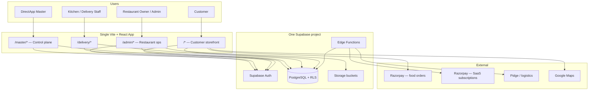
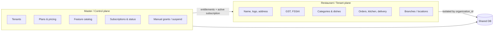
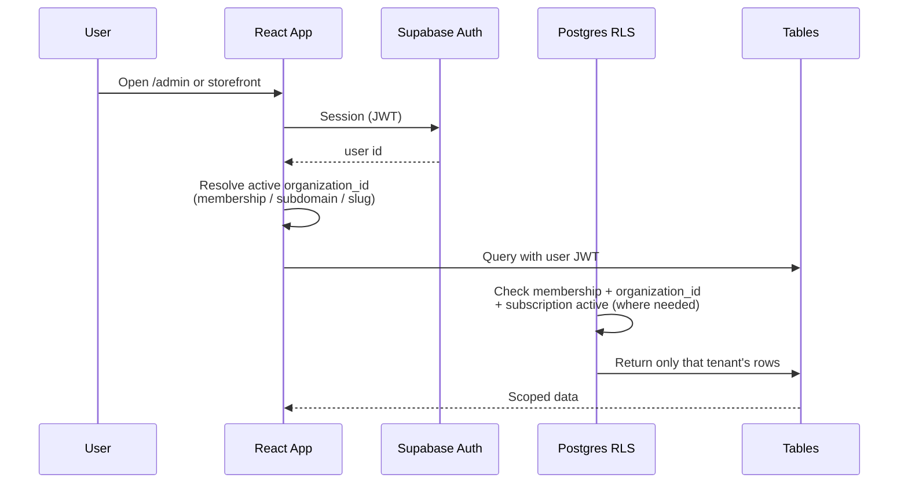
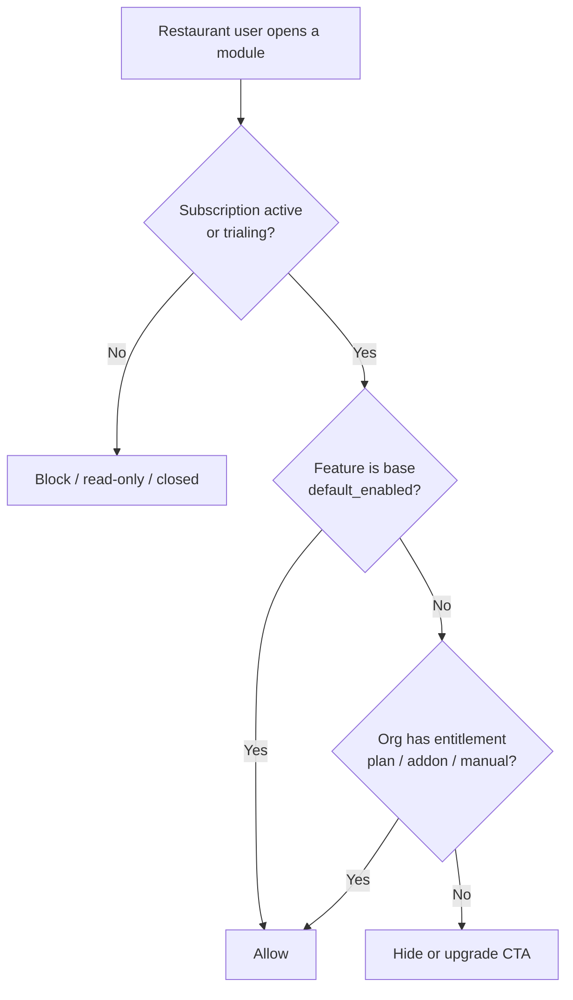
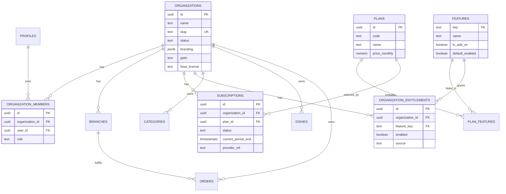

# SaaS Multi-Tenant Architecture Plan

> **As-built (August 2026):** Master UI, host tenancy, OAuth handoff, and two live tenants are implemented. Do not use this July plan as the validation source. See **[ARCHITECTURE_AND_SAAS_MODEL.md](./ARCHITECTURE_AND_SAAS_MODEL.md)**.

**Product:** Taste of Andhra → Restaurant Platform (SaaS)  
**Date:** 2026-07-27 (updated 2026-07-28)  
**Status:** Historical plan. Several “not started” items below are now live.  
**Stack:** Vite + React SPA · Supabase Auth · PostgreSQL · RLS · Edge Functions  
**Detailed DB diagrams:** [SAAS_DATABASE_DIAGRAM.md](./SAAS_DATABASE_DIAGRAM.md)

---

## 1. Purpose

Convert the current **single-restaurant** app into a **multi-tenant SaaS** where:

- A **Master (platform superuser)** manages tenants, plans, feature entitlements, and billing.
- Each **restaurant (tenant)** manages only its own brand, menu, GST, FSSAI, branches, and operations.
- **New base features** ship once and are available to all active tenants by default.
- **Paid add-ons** (integrations, advanced modules) are enabled per tenant based on purchase.
- One shared app and database stay **low-cost and maintainable**.

Taste of Andhra becomes **tenant #1**, not the platform itself.

---

## 2. Current state vs target

| Area | Today | Target |
|------|--------|--------|
| Tenancy | None (whole DB = one restaurant) | `organizations` + RLS by `organization_id` |
| Locations | `branches` (multi-location for one brand) | Branches under an organization |
| Admin | Global `admin` role | `restaurant_admin` (scoped) + `platform_master` |
| Branding | Hardcoded `src/constants/APP.ts` | Per-org settings in DB |
| Features | All modules visible to that one admin | Catalog + entitlements |
| Billing | Food payments (Razorpay) only | SaaS subscriptions + payment-period checks |
| Menu / GST / FSSAI | Implicitly one restaurant | Explicitly per organization |

---

## 3. High-level architecture

### 3.1 System context



### 3.2 Control plane vs tenant plane



### 3.3 Request path (tenant isolation)



### 3.4 Feature & billing decision



---

## 4. Domain model

### 4.1 Entity relationship (logical)



### 4.2 What is global vs restaurant-specific

| Global (Master / platform) | Restaurant-specific (tenant) |
|----------------------------|------------------------------|
| Feature catalog | Restaurant name, logo, tagline |
| Plans & prices | Address(es), phone, email, hours |
| Subscription status | GSTIN, FSSAI |
| Platform defaults / templates | Categories, dishes, prices |
| Integration *definitions* | Orders, customers (ops), offers |
| Master users | Branches, QR tables, delivery settings |
| | Payment keys / Pidge tokens (per org) |

### 4.3 Suggested feature keys (coarse modules)

Keep flags **coarse** to reduce maintenance.

| Key | Type | Maps to current admin area |
|-----|------|----------------------------|
| `menu` | Base | Categories, Dishes |
| `orders` | Base | Orders, Dashboard |
| `customers` | Base | Customers |
| `offers` | Base | Offers |
| `reports` | Base | Reports |
| `settings` | Base | Settings (brand, GST, FSSAI) |
| `delivery_own` | Base | Delivery + partners |
| `branches` | Add-on or plan tier | Branches (multi-location) |
| `qr_tables` | Add-on | QR Tables |
| `party_inquiries` | Add-on | Party Inquiries |
| `delivery_pidge` | Add-on | Pidge provider |
| `loyalty` | Add-on | Loyalty (when enabled) |

**Rule:** New product features default to `default_enabled = true` (base). Only partner/costly/capacity features become add-ons.

---

## 5. Roles & consoles

| Role | Console | Can do |
|------|---------|--------|
| `platform_master` | `/master/*` | Create tenants, plans, features; view billing; grant/revoke; suspend; support “act as org” |
| `restaurant_owner` / `restaurant_admin` | `/admin/*` | Full ops for **their** organization |
| `delivery` | `/delivery/*` | Assigned deliveries for their org |
| `customer` | Storefront | Order from a restaurant context |

**Important:** Do not reuse today’s global `admin` as Master. Master is a separate role and route tree.

---

## 6. Billing model (Master)

1. Plans live in DB; prices charged via **Razorpay Subscriptions** (or Stripe later).
2. Local `subscriptions` row is the **source of truth for access**:
   - `status`: `trialing` | `active` | `past_due` | `cancelled` | `suspended`
   - `current_period_end`: end of paid/trial window
3. Webhooks update status; a **daily Edge Function** reconciles and suspends expired orgs.
4. Master UI can manually extend, comp, or suspend (support / pilots).
5. **Access rule for restaurant admin writes:**

   ```text
   status IN ('trialing', 'active')
   AND current_period_end > now()
   ```

   Optional grace: allow `past_due` for 3–7 days before hard suspend.

Food checkout Razorpay keys remain **per restaurant** (or platform-collected later). Do not mix SaaS subscription charges with customer food payments in the same mental model.

---

## 7. Technical principles (low cost, easy maintenance)

1. **One shared Postgres** — no DB-per-tenant.
2. **RLS everywhere** — `organization_id` on tenant tables; never trust UI-only filters.
3. **One deployment** — tenant resolved by subdomain or `/{slug}` + membership.
4. **Coarse entitlements** — few feature keys, not dozens of tiny toggles.
5. **Provider-hosted SaaS billing** — store status locally; do not build a full billing engine in v1.
6. **Taste of Andhra = first org** — migrate existing data; do not fork the codebase.

---

## 8. Implementation steps

### Phase 0 — Finish single-restaurant MVP (now)

**Goal:** Stable product for Taste of Andhra.

- Complete orders, kitchen, delivery, payments, settings as today.
- Avoid adding more hardcoded brand values when a DB setting would do.
- **Do not** sell a second restaurant yet.

**Exit criteria:** Production-ready ops for one restaurant.

---

### Phase 1 — Tenant foundation (schema + RLS)

**Goal:** Security boundary before any second tenant.

1. Add tables: `organizations`, `organization_members`.
2. Add `organization_id` to tenant-owned tables (categories, dishes, orders, offers, branches, delivery_*, party_inquiries, app settings per org, etc.).
3. Create org **Taste of Andhra**; backfill all existing rows to that `organization_id`.
4. Move branding / GST / FSSAI from `APP.ts` into `organizations` (or `organization_settings`).
5. Replace global `is_admin()` with membership-aware helpers, e.g. `is_org_admin(org_id)` / `is_platform_master()`.
6. Rewrite RLS so restaurant admins only see their org; Master sees all (or via service role + Master API).
7. Fix uniqueness: `(organization_id, slug)`, `(organization_id, order_number)`, etc.
8. Scope storage paths: `{organization_id}/...`.

**Exit criteria:** With two test orgs in one DB, Admin A cannot read Admin B’s menu/orders via API.

---

### Phase 2 — App tenancy wiring

**Goal:** Frontend and services always operate in an org context.

1. Add `OrganizationContext` (active org from membership / slug / subdomain).
2. Update all `src/services/*` queries to filter by `organization_id` (belt-and-suspenders with RLS).
3. Storefront loads brand/menu for current org slug.
4. Keep `/admin` as restaurant console; bind session user → membership → org.
5. Migrate env-style single-business config (Google Place ID, etc.) to per-org settings where needed.

**Exit criteria:** Taste of Andhra works unchanged for users, but data path is tenant-aware.

---

### Phase 3 — Feature catalog & entitlements

**Goal:** Flexible module enablement without code forks.

1. Add `features`, `plans`, `plan_features`, `organization_entitlements`.
2. Seed base features (`menu`, `orders`, …) with `default_enabled = true`.
3. Mark current optional modules as add-ons (`qr_tables`, `party_inquiries`, `delivery_pidge`, `branches` if paid).
4. Add DB helper `has_feature(org_id, key)` used by RLS and/or Edge Functions.
5. Admin nav renders only entitled modules; deep links show upgrade CTA if locked.
6. Policy: inserting a new base feature auto-available to all **active** subscribers.

**Exit criteria:** Master (or SQL seed) can turn off `party_inquiries` for one org without redeploying.

---

### Phase 4 — Master console & billing

**Goal:** You control tenants, money, and access.

1. Add `platform_master` role (or separate allowlist table).
2. Build `/master` UI:
   - Tenant list / create / suspend
   - Plans & feature matrix
   - Subscription status & period end
   - Manual entitlement grants
   - Optional: “view as tenant” with audit log
3. Integrate Razorpay Subscriptions (or equivalent): create subscription, webhooks → `subscriptions` row.
4. Edge cron: expire / suspend unpaid tenants; grace period configurable.
5. Gate restaurant admin writes on active subscription.

**Exit criteria:** Master can create tenant #2, assign a plan, and revoke access when unpaid.

---

### Phase 5 — Self-serve onboarding (later)

**Goal:** Restaurants sign up without manual SQL.

1. Signup → create `organization` + owner membership + trial subscription.
2. Onboarding wizard: name, address, GST/FSSAI, first branch, first category.
3. Optional restaurant templates (Andhra, cafe, cloud kitchen).
4. Domain / subdomain mapping for white-label later.

**Exit criteria:** A new restaurant can go live on a trial without Master creating every row by hand.

---

### Phase 6 — Scale features (future)

Only after Phases 1–4 are stable:

- Multi-location packs / franchises / cloud kitchens (org hierarchies if needed)
- White-label domains & themes
- Swiggy / Zomato / ONDC connectors as add-ons
- WhatsApp notifications as add-on
- Per-org analytics and usage limits

---

## 9. Suggested Master screens (Phase 4)

| Screen | Purpose |
|--------|---------|
| Dashboard | Active tenants, MRR/trials, past_due count |
| Tenants | Search, status, plan, period end, suspend |
| Tenant detail | Members, entitlements, billing history, “view as” |
| Plans | CRUD plans, price, included features |
| Features | Catalog; mark base vs add-on |
| Billing events | Webhook log / failed payments |
| Audit | Master actions (grants, suspends, impersonation) |

---

## 10. Migration checklist for Taste of Andhra (tenant #1)

- [ ] Create `organizations` row (name, slug `taste-of-andhra`, branding from `APP.ts`)
- [ ] Backfill `organization_id` on all existing business rows
- [ ] Map current `admin` users → `organization_members` as `restaurant_owner`
- [ ] Move contact, hours, GST, FSSAI into org settings
- [ ] Point storage objects under org prefix (or accept legacy paths + dual-read)
- [ ] Verify RLS with a second dummy org
- [ ] Keep customer-facing URLs working (redirect if slug introduced)

---

## 11. Risks & mitigations

| Risk | Mitigation |
|------|------------|
| Global admin leaks all tenant data | Membership-scoped RLS; automated isolation tests |
| Unique constraints block second tenant | Composite unique indexes with `organization_id` |
| Too many feature flags | Coarse modules only |
| Webhook miss → wrong access | Daily reconciliation + Master override |
| Suspend mid-delivery | Grace period before hard lock |
| Shared customer accounts confusion | Orders always tagged by org; revisit CRM isolation later |
| Mixing food Razorpay & SaaS Razorpay | Separate products/keys and clear naming in Master |
| Scope creep (franchise, ONDC, white-label) | Lock to Phases 1–4 before Phase 6 |

---

## 12. Decision summary

| Decision | Choice | Why |
|----------|--------|-----|
| Tenancy style | Shared DB + RLS | Lowest cost; fits Supabase |
| Control plane | Master console + subscriptions | Billing & entitlements in one place |
| New features | Default ON for active tenants | Matches “available for everyone” |
| Paid modules | Coarse add-ons | Easy to sell and maintain |
| Timing | MVP → foundation → entitlements → Master billing → self-serve | Avoids rebuilding before product works |
| First tenant | Taste of Andhra | Real migration proves the model |

---

## 13. Next actions (when ready to implement)

1. Approve this document (especially feature base vs add-on list and Phase 0 exit).
2. Draft Phase 1 SQL migration sketches (`organizations`, members, backfill).
3. Write isolation test plan (two orgs, cross-read must fail).
4. Only then start coding Phase 1 — do not build Master UI before RLS exists.

---

*Related prior analysis: single-restaurant assumptions across schema, RLS, services, and `APP.ts` branding. This document is the recommended path forward.*
