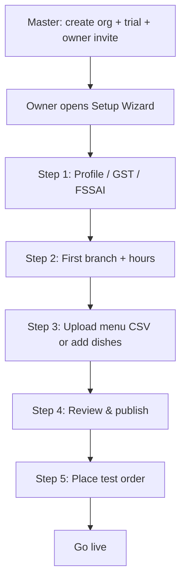

# Restaurant Onboarding Kit — How to Collect Data & Go Live

**Goal:** Restaurant owners can share details easily; your team (or the product) can load a tenant with **minimal manual work**; owners can finish setup themselves with clear guidance.

**Principle:** Prefer **structured templates + self-serve admin** over email threads and PDF-only workflows.

---

## 1. Recommendation (what to do and why)

### Recommended model: **Guided self-serve + optional assisted import**

| Mode | When to use | Who does the work |
|------|-------------|-------------------|
| **A. Self-serve (default)** | Owner is comfortable with phone/laptop | Owner fills in-app wizard; your team only supports |
| **B. Assisted import** | Owner sends WhatsApp/email packs | Owner fills **2 templates**; you (or Master tool) import once |
| **C. Full-service (rare)** | High-value deal, owner has no time | You fill from PDF; owner only reviews & publishes |

**Why this is best**

1. **Less work for you** — most restaurants use Mode A or B; you don’t rebuild menus by hand.
2. **Flexible for them** — they can DIY in admin, or send sheets if they prefer WhatsApp.
3. **Accurate data** — structured fields beat free-form PDF/chat for prices, veg, GST, FSSAI.
4. **Repeatable** — same kit for every tenant; Master onboarding stays cheap.
5. **PDF stays optional** — use as reference, not as the system of record.

**Do not rely on:** “Send us anything” (photos of menus, long WhatsApp voice notes) as the primary path — high rework for you.

---

## 2. What you should provide to every restaurant owner

Give them a small **Onboarding Pack** (WhatsApp/email + link):

1. **Setup guide** (this doc, short version for owners — §7)
2. **Restaurant profile form** — Google Form **or** `RESTAURANT_PROFILE_TEMPLATE.md` / sheet
3. **Menu spreadsheet** — `MENU_IMPORT_TEMPLATE.csv`
4. **Optional:** logo file rules + dish photo tips
5. **Link/login** to their admin (once tenant exists) so they can edit after import

Keep the pack to **≤ 3 asks**: Profile + Menu sheet + Logo. Everything else can be done later in admin.

---

## 3. Data to collect (two templates only)

### Template 1 — Restaurant profile (one row / one form)

| Field | Required? | Why |
|-------|-----------|-----|
| Restaurant display name | Yes | Branding |
| Preferred URL slug (e.g. `spice-garden`) | Yes | Storefront link |
| Owner full name | Yes | Account |
| Owner phone (WhatsApp) | Yes | Login / support |
| Owner email | Yes | Login / billing |
| Business phone (public) | Yes | Storefront / calls |
| Public email | Nice | Contact page |
| Full address, city, state, pincode | Yes | Delivery / maps |
| Landmark | Nice | Riders / customers |
| GSTIN | If registered | Invoices / compliance |
| FSSAI license number | Yes (India food) | Trust / compliance |
| Opening hours (weekday / weekend) | Yes | Storefront |
| Cuisine type / short tagline | Nice | Homepage |
| Logo file (PNG/JPG, square) | Nice | Branding |
| Default delivery mode (own / later partner) | Nice | Ops |
| Service pincodes or approx radius (km) | Nice | Delivery setup |
| Bank/UPI or Razorpay account holder note | Later | Payouts — not needed day 1 |

### Template 2 — Menu spreadsheet (many rows)

Use `MENU_IMPORT_TEMPLATE.csv` columns:

| Column | Required? | Notes |
|--------|-----------|--------|
| `category` | Yes | e.g. Starters, Biryani |
| `name` | Yes | Dish name |
| `price` | Yes | Number only, INR |
| `is_veg` | Yes | `TRUE` / `FALSE` |
| `spice_level` | Nice | `mild` / `medium` / `hot` / `extra_hot` |
| `description` | Nice | 1 short line |
| `preparation_time_minutes` | Nice | Number |
| `is_available` | Nice | Default `TRUE` |
| `is_featured` | Nice | Default `FALSE` |
| `display_order` | Nice | Lower = higher in list |

**Optional later:** images (URLs or zip) — don’t block go-live on photos.

---

## 4. How owners should share data (easy channels)

Pick **one primary** channel so your inbox doesn’t fragment.

| Channel | Best for | How |
|---------|----------|-----|
| **Google Form + Google Sheet** | Profile + menu (most owners) | Form writes profile; menu = shared Sheet from CSV template |
| **WhatsApp** | India SMB reality | Owner sends filled Excel/CSV + logo; you acknowledge checklist |
| **In-app wizard** (target product) | Scale | Owner types/pastes; no human import |
| **Email** | Formal / GST docs | Same attachments as WhatsApp |

**Recommended operating procedure (now → later)**

```text
NOW (low build):
  Master creates tenant → send Onboarding Pack →
  owner returns Profile + Menu CSV →
  import once → owner gets admin login →
  owner reviews, adds photos, publishes

NEXT (saves more time):
  In-app Setup Wizard (profile → branch → paste/upload CSV → review → go live)
  Master only creates org + trial; owner does the rest

LATER:
  PDF upload → AI draft rows → owner confirms → import
```

---

## 5. Mechanism that minimizes *your* work

### Target workflow (product)



**Your ongoing work should shrink to:**

- Create tenant + send invite (1–2 minutes)
- Support chat if stuck
- Rare assisted CSV import

**Avoid** becoming the permanent data-entry team for every menu change — that belongs in **Restaurant Admin → Dishes**.

### Assisted import (human or script)

1. Validate CSV (required columns, prices numeric, veg boolean).
2. Create categories (unique by name per org).
3. Create dishes linked to categories.
4. Leave `is_available = false` until owner reviews (**best practice**), or publish if they confirmed.
5. Notify owner: “Review menu in Admin → publish when ready.”

---

## 6. Flexibility: what owners finish themselves (saves you time)

After first load, push them to admin for:

- Fix prices / typos  
- Add/remove dishes  
- Upload dish images  
- Delivery pincodes / charges  
- Offers, party inquiries (if entitled)  
- Second branch (if on plan)

**Guidance rule:** “We load the first version once; after that, you own the menu in Admin — changes take effect immediately.”

That sets expectations and cuts repeat work.

---

## 7. Short guidance to send restaurant owners

Copy/paste (WhatsApp/email):

---

**Welcome — restaurant setup (15–30 minutes)**

We use the same platform for every restaurant. You keep control of your name, address, GST, FSSAI, and menu.

**Please send us / fill:**

1. **Restaurant profile** — name, address, phone, GSTIN, FSSAI, hours (form or profile template).  
2. **Menu spreadsheet** — use our Excel/CSV template (one row per dish).  
3. **Logo** (optional) — square PNG/JPG.

**Tips for the menu sheet**

- One dish per row.  
- Price as number only (e.g. `249`, not `₹249`).  
- Mark veg correctly (`TRUE` / `FALSE`).  
- Group with clear category names (Starters, Main Course, Beverages…).  
- Skip photos for now; you can add them later in Admin.

**What happens next**

1. We create your restaurant account.  
2. We load your profile + menu.  
3. You log in to Admin, check everything, add photos if you want.  
4. You place one test order.  
5. We switch you live.

**After go-live:** update menu anytime in Admin → Dishes / Categories. No need to resend spreadsheets for small changes.

If you only have a PDF menu: that’s fine as a reference — please still fill the spreadsheet (or ask us for assisted help once). Spreadsheet = faster and fewer mistakes.

---

## 8. Quality checklist before go-live (owner or you)

- [ ] Name, phone, address correct on storefront  
- [ ] GSTIN / FSSAI saved (if applicable)  
- [ ] At least one category and 5+ available dishes  
- [ ] Prices look right  
- [ ] Veg / non-veg flags correct  
- [ ] Hours shown  
- [ ] Delivery area set (or pickup-only clear)  
- [ ] Admin login works for owner  
- [ ] One test order completed (pay + kitchen status)  
- [ ] Owner knows how to mark dish unavailable

---

## 9. What not to do

| Avoid | Why |
|-------|-----|
| Accept only PDF/photos with no sheet | Slow, error-prone for your team |
| Recreate full menu in chat messages | No audit trail; easy to miss items |
| Promise “we’ll always update your menu for you” | Doesn’t scale |
| Go live without owner review | Wrong prices damage trust |
| Different process per restaurant | You lose the time savings |

---

## 10. Summary — best practice

| Question | Answer |
|----------|--------|
| What to provide owners? | Profile form/template + menu CSV + short setup guide + later admin login |
| How they share? | Google Form/Sheet or WhatsApp with those 2 files |
| Ideal product? | Invite → Setup Wizard → CSV upload → review → test order → live |
| How you save time? | Structured templates + owner self-serve after first load |
| Role of PDF? | Optional reference; spreadsheet (or wizard) is the real input |

**Bottom line:** Make the **easy path** = fill two templates (or in-app wizard). Make the **flexible path** = owner finishes and maintains in Admin. Use assisted PDF/AI only as a paid or premium time-saver later — not as the foundation.
